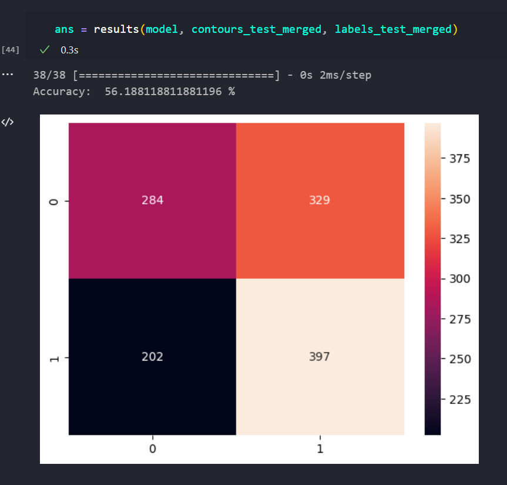
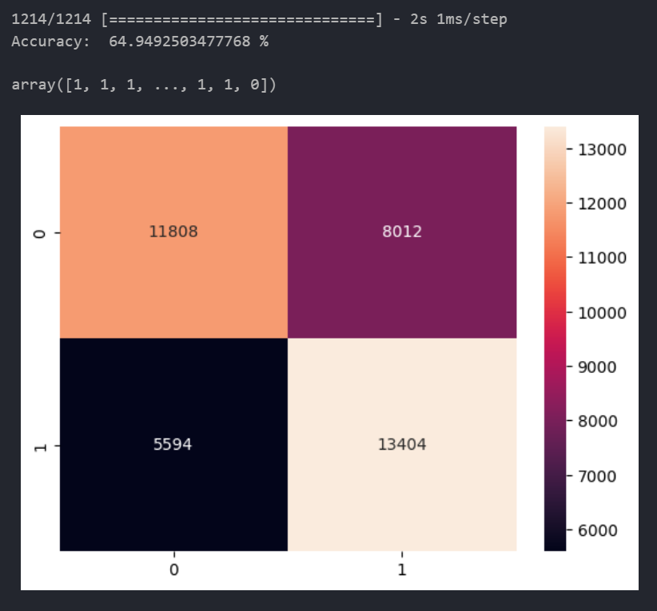
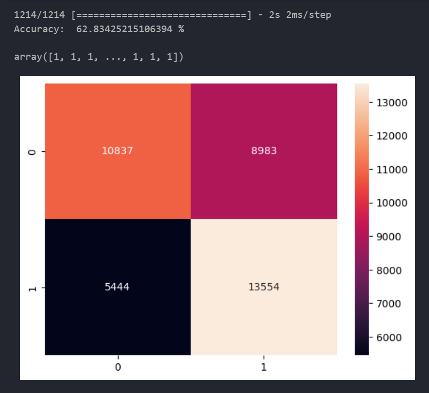
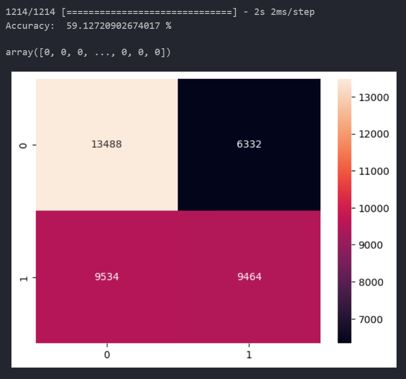
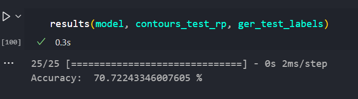
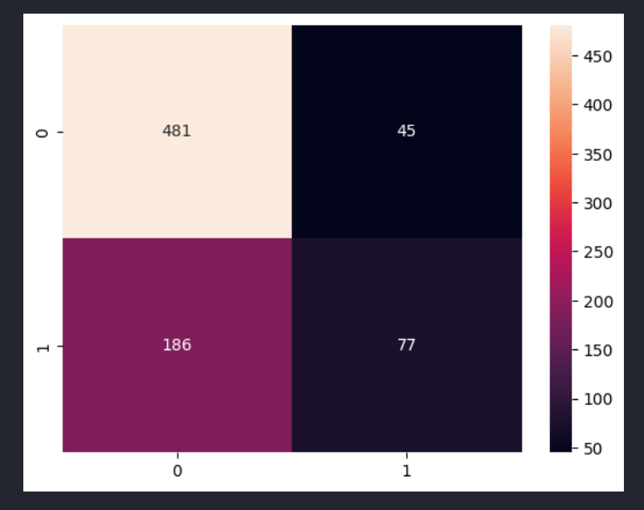
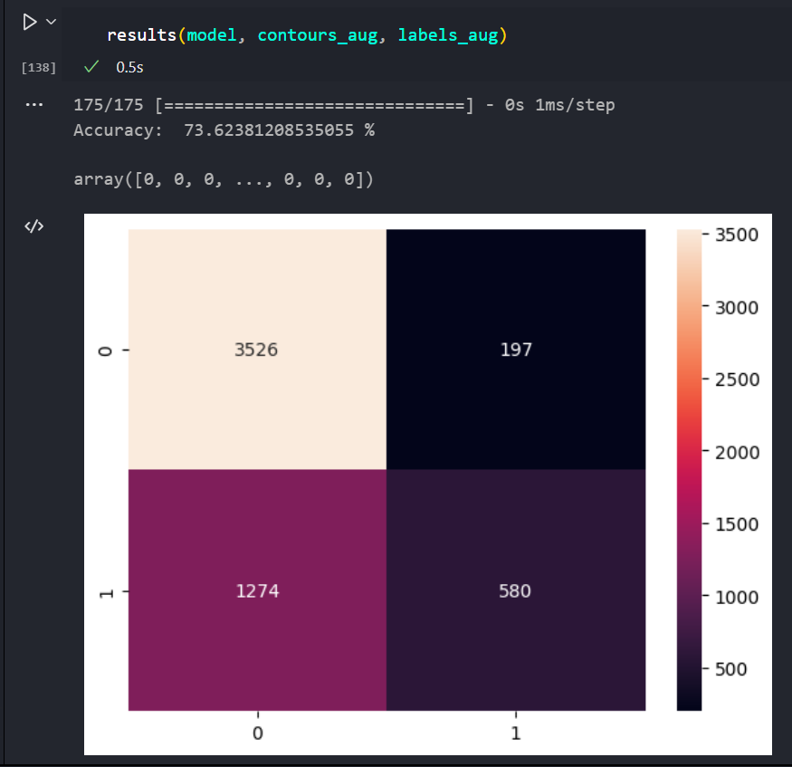
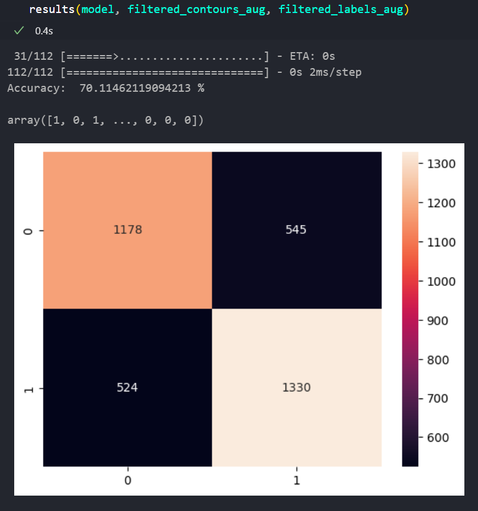

# Augmentation
* Earlier we were simply right padding or left padding
* Now we vary the degree of padding:
* to ensure that the contour is present at various locations
* This will help the model learn that even if the contour's position on the x axis changes
  shouldnt affect its label.

* Pranjal ---> Layers, how balanced the dataset is
* Abhay ---> Explain augmentation
* Pranjal ---> Transformers, ..
* Abhay ---> 234 and ReadME
* Pranjal ---> Duration
* SEQ 2 SEQ

# 2 Syll Words
* Every word is either of the form 0,1 or 1,0
* The dataset is almost perfectly balanced

Augmentation 

Augmentation and More Layers (Highest Dense Layer = 128), (Trainable Parameters = 28,000) 

Augmentation and More Layers (Highest Dense Layer = 256), (Trainable Parameters = 76,000) 

Augmentation, 256 Top Layer, Dropout 
Dropout didn't work 

# 3 Syll Words
*    Most words have 1 stressed and 2 unstressed
* 33% 1, 66% 0
* Lower max contour length
* Higher accuracy
* Results are skewed towards 0s
* Much fewer data to work with (3000)

Augmentation Skewed 

Augmentation Balanced 
* The previous model (skewed) was biased towards 0 (essentially predicting 0s all the time)
* The current model (balanced) was far more even

We did not go beyond 3 syllables because the sample size of 4 syll words was too low

* Focus on 2 syls
* Report on test data

# SEQ 2 SEQ
* Instead of one syllable
* Input SEQ -> Contour of the entire word
* Output SEQ -> Sequence of labels
* 2 syllable incorporate duration

<!-- ------------------------------------------------------------------------ -->
epochs 10     batch 32 :  (35, 411)
epochs 100    batch 32 :  (110, 336)
epochs 100    batch 64 :  (121, 325)
epochs 100    batch 128:  (141, 305)
epochs 100    batch 256:  (147, 299)
epochs 100    batch 512:  (156, 290)
epochs 100    batch 1024: (141, 305)
epochs 200    batch 512:  (157, 289)
epochs 1000   batch 512:  (151, 295)
<!-- ------------------------------------------------------------------------ -->
epochs 10     batch 32: (519, 942, 35.52%)
epochs 100    batch 32: (531, 930, 36.35%)
epochs 30     batch 64: (501, 960, 34.29%)