# Speech-Prominence-Detection
Correct prominence on the words and the part of the word is important for the right pronunciation. Some people may find it difficult to learn correct prominence placement on the pronunciation of English words. This project revolves around building a model that can predict the prominence of the syllables in speech data. Consequently, this model could serve as a teaching tool for individuals who are learning English.

### Developer Team
* `Abhay Patil`
* `Pranjal Thapliyal`

### Client
* `Chiranjeevi Yarra`

### Mentor
* `Mallela Jhansi`

Duration: January 2023 to December 2023

 

# PERT Chart

Brief outline of the project:
* The two side branches i.e. `Twitter Sentiment Analysis` and `Transformers` represent side projects done to familiarize ourselves with the topic and learn general speech processing methods.
* The main central branch represents the sequential methods taken to arrive at the final `speech prominence detection model`.
 
 
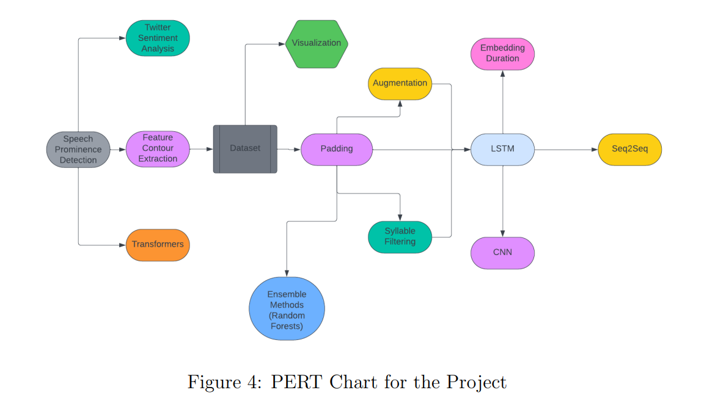
 
 
 

# Feature Contour Extraction

The first step of the workflow involved preprocessing the raw speech data. We were given code that extracts the relevant information from an audio file and represents it as a feature contour, which is more readily usable in the context of machine learning. We modified the given python2 code to python3 to make it more convenient to work with, and generated a dataset that mapped the feature contour associated with each syllable to a binary label with 0 indicating that the syllable was unstressed and 1 indicating stressed.

# Preprocessing
## Padding

The feature contours were of varying length (3 to 247, average 138). In order to feed the feature contours into a CNN, we padded them so that they were all of the same length i.e. 247. We experimented with various types of padding left, right, and center.

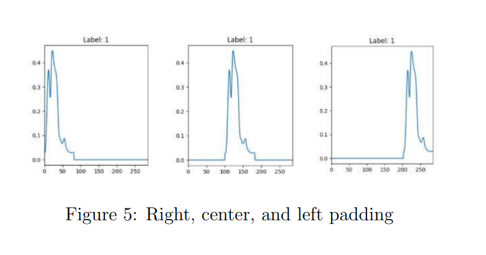
 
 

Surprisingly, we found that the type of padding had a significant impact on the accuracy of the model. Right padding had a significantly higher accuracy that the others, and hence we used this proceeding forward.

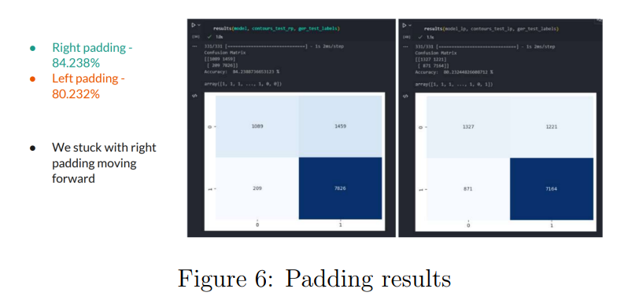
 

## Augmentation

Following our work on padding, we came up with a novel preprocessing technique that significantly enhanced all our results moving forward. We varied the degree of padding on the left and right side of the contour, essentially modifying the temporal location of the feature contour. This teaches the model that the position of the feature contour on the x-axis (i.e. when the sound signal starts and ends) is irrelevant, and encourages it to focus on the shape of the contour instead.

 
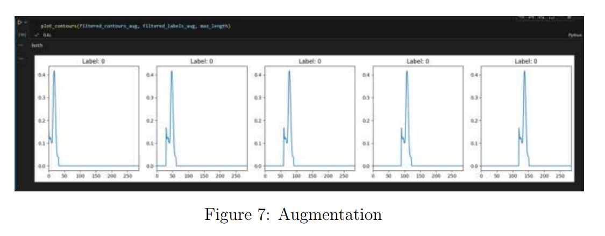
 
 

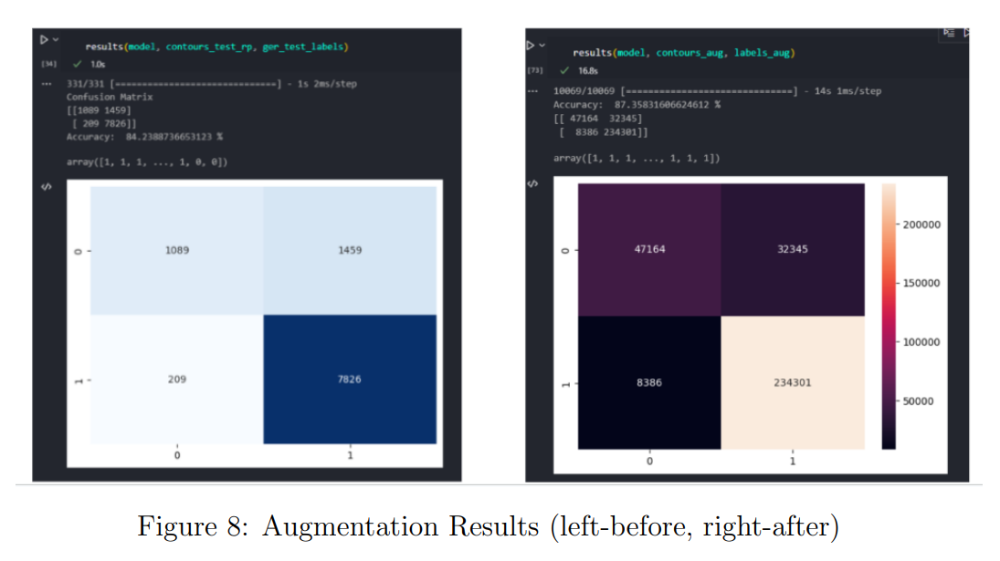
 

It is important to note that augmentation drastically increases the size of the dataset, which is the reason for the larger numbers on the right figure compared to the one on the left.

## Monosyllabic Filtering

The most prevalent challenge we faced was that the dataset was inherently skewed. A vast majority of the syllables in the speech data were monosyllabic, which means that the syllable is always stressed i.e. label 1. This results in

a skewed dataset wherein we had more 1’s (75.57%) than 0’s (24.43%).

Our models were able to exploit the skewness of the data simply by predicting the majority label most of the time. For instance, a model that always predicted 1’s can achieve an accuracy of 75.57% without learning anything about the feature contours.

 
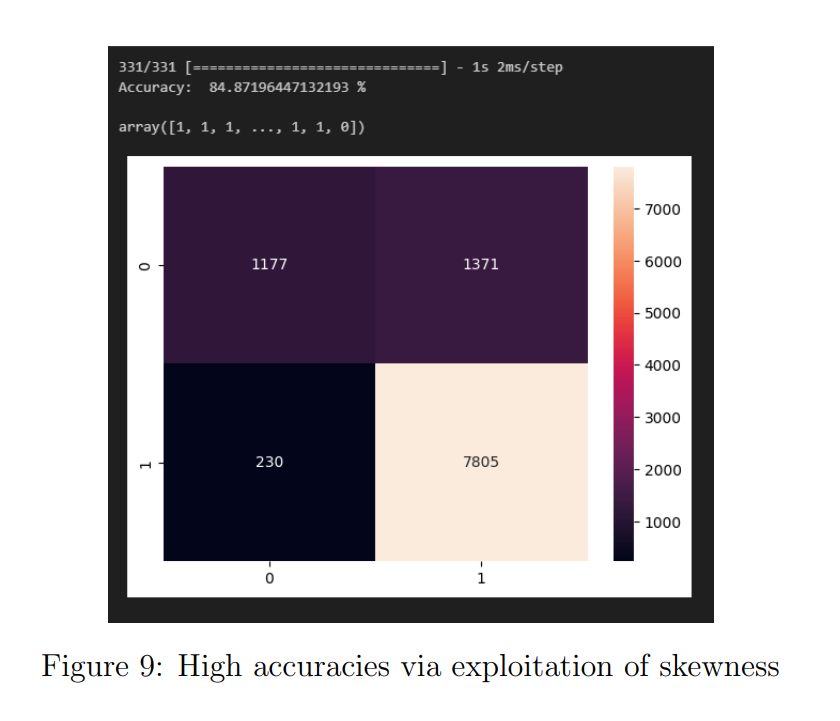
 
 

In figure 8 above, the y-axis represents true labels and the x-axis represents the predicted labels. The model performs well on the stressed labels i.e. 7805 correct and 230 wrong. However, the model performs extremely poorly on the unstressed labels i.e. 1177 correct and 1371 wrong.

To combat this, we modified the feature extraction code to filter out all the monosyllabic words, and the result was a fairly balanced dataset. Following this modification, our accuracies took a significant hit (84.87% to 69.64%).

 
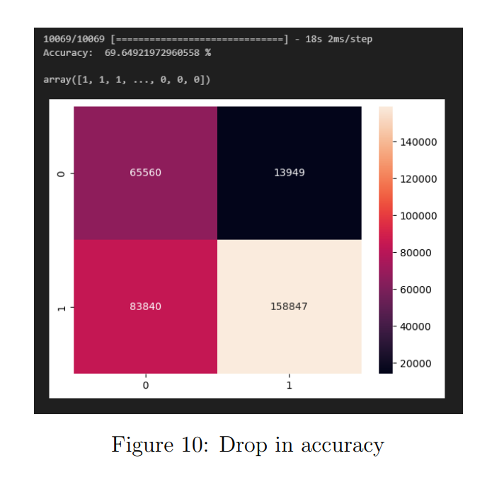
 
 

On the upside, there was no skewness to exploit, meaning that despite the lower accuracy, the model was learning better. As evidence, consider the above confusion matrix. This time, the model was performing much better on the unstressed labels (65,560 correct and 13,949 wrong).

# Methods

Initially, we decided to use an LSTM model as our seq2seq model, since LSTM’s are known to work very well for sequences of variable lengths. This is also primarily the model which we used throughout our project, and so, unless explicitly mentioned otherwise, assume that we used an LSTM model only.

However, we did try out some other architectures as part of different threads in order to confirm and validate whether LSTM’s were indeed the right choice or not. This was achieved by first padding all the sequences to the length of the maximum sequence (as described in the above sections), and then trying out some other model architectures on this post-processed

dataset.

## Transformer
We tried to implement two models : BERT and ELECTRA.
However, both of them showed horrible accuracies, and hence were subsequently dropped from further consideration.

 
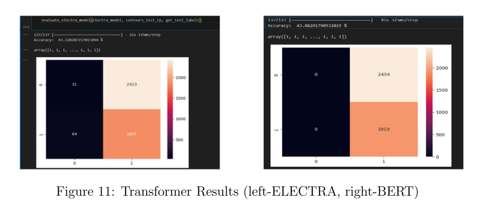
 
 

## Ensemble Methods
We then tried ensemble learning, which showed much better results compared to transformer(s).
We also tried hyper-parameter tuning for the same.
Ultimately, we could see that the random forest model was exhibiting a similar accuracy to our existing LSTM model, whilst transformers were clearly a bad choice for the task at hand.

 
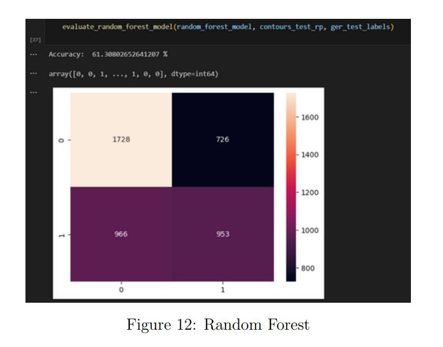
 
 

## Syllable Segregation

As an extension to eliminating monosyllabic words, we modified the feature contour extraction code to only include words that had a specific number of syllables. As a result, we were able to analyse how the model performs on 2 syllable words compared to 3 syllable words.

The 2 syllable dataset was perfectly balanced. This was because the contours were of the form (0 1) or (1 0), meaning that the word always had a stressed and unstressed syllable. We evaluated the model on raw data (56.18% accuracy) and augmented data (64.95% accuracy).

 
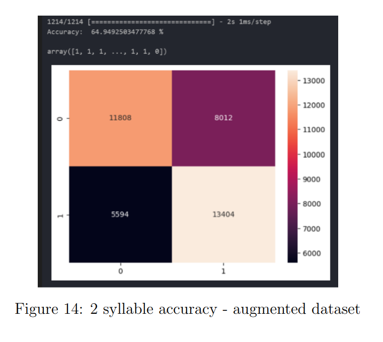
 
 

On the other hand, the 3 syllable dataset was skewed. It is important to note that this dataset was skewed towards 0’s rather than 1’s, unlike the original dataset. We tried dropping records where the syllable was unstressed in an attempt to balance the dataset.

With the balanced dataset, we had a slightly lower accuracy (70.11%) compared to the skewed dataset (73.62%). However just like before, the model was learning better, as is evident from the confusion matrices. Specifically, the model trained on the balanced dataset performs fairly well on the stressed syllables whereas the model trained on the skewed dataset performs poorly.

 
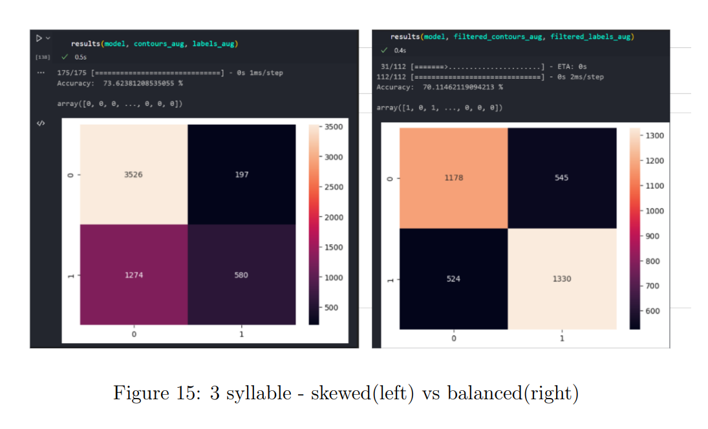
 
 

The size difference between the 2 syllable (1212) and 3 syllable (789) datasets are important to note. We did not analyse the 4 syllable dataset, because it was too small (less than 100) for our models to train effectively.

## Incorporating Duration

We then tried to incorporate duration i.e. the length of the original contours into our dataset, to try and see if it would have any effect on the accuracy.

We implemented this in two manners : if the contours were padded to the left, then we appended the length to the beginning of the contour, and if they were padded to the right, then we appended the length to the end of the contour. This was done to separate this ”length” from the rest of the contour.

We tried it with both the LSTM as well as the random forest models.

## Incorporating other attributes
We then tried to incorporate other possible attributes to the contour in a similar manner to the duration.
These attributes included the mean value of the contour, the min value, and the max value.
The accuracies were pretty similar for all of these attributes around 60%, which was similar to that of the duration.

 
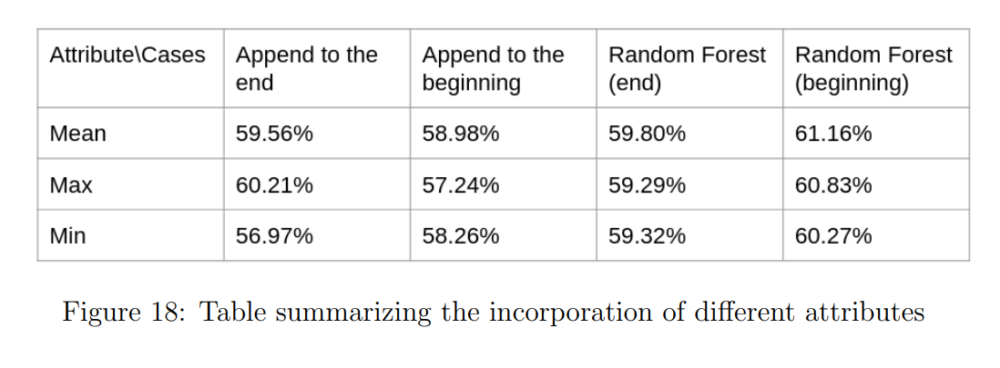
 
 

## Seq2seq model
So far, we had actually implemented a sequence to a binary classification model.
We then tried to combine two (and afterwards, three) contours together to be able to train a seq2seq model on the resulting dataset.
We rewrote the seq2seq LSTM code from scratch for 2 concatenated contours, and were subsequently able to achieve an accuracy of almost 70%.
We also tried some hyper-parameter tuning for the above model, but the above accuracy turned out to be the best possible accuracy.

We then tried the same for 3 concatenated contours, and we actually observed a dip in the accuracy.
 
 

# Related Projects

During the course of the BTP (B.Tech Project), we worked on projects that are closely related to Speech Prominence Detection, that can also act as standalone products or micro-services.

## 1. Twitter Sentiment Analysis

We developed a model that takes a large body of text as input, and extracts a smaller subset of the text that is relevant to sentiment analysis.

 
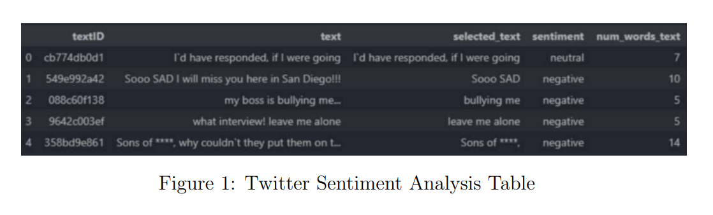
 
 

 
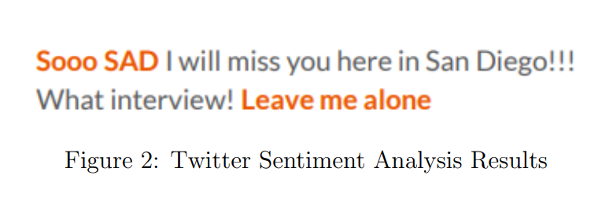
 
 

## Syllable Boundary Detector

In order to understand how our model was interpreting the feature contours, we separated the contours syllable wise, adding boundaries to the beginning and end of each syllable. This visualization may prove useful in other research contexts where a fine-grained analysis of speech patterns is necessary.

For instance, when studying language acquisition in children, a syllable boundary detector can offer valuable insights into the temporal aspects of speech production.

 
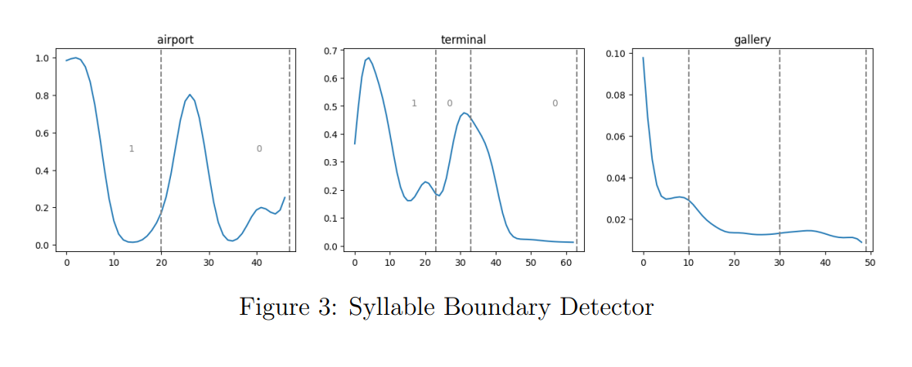
 
 

# Conclusion

In conclusion, this project aimed to develop a sequence-to-sequence (seq2seq) model for predicting syllable stress in a given word or statement. Leveraging a fixed code that converts audio signals into normalized contours and separates them into constituent syllables, we explored various approaches to enhance model performance. Through meticulous pre-processing, sequence reformatting, and hyper-parameter tuning, we successfully adapted the seq2seq architecture to accommodate the intricacies of syllabic stress prediction. The combination of advanced deep learning techniques and tailored pre-processing methodologies has resulted in robust models capable of accurately predicting stress patterns, offering valuable insights into the nuanced rhythm and intonation of spoken language.